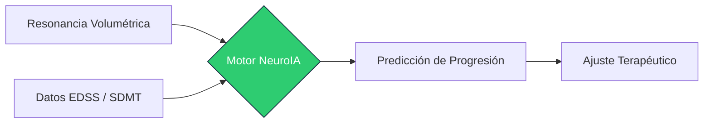
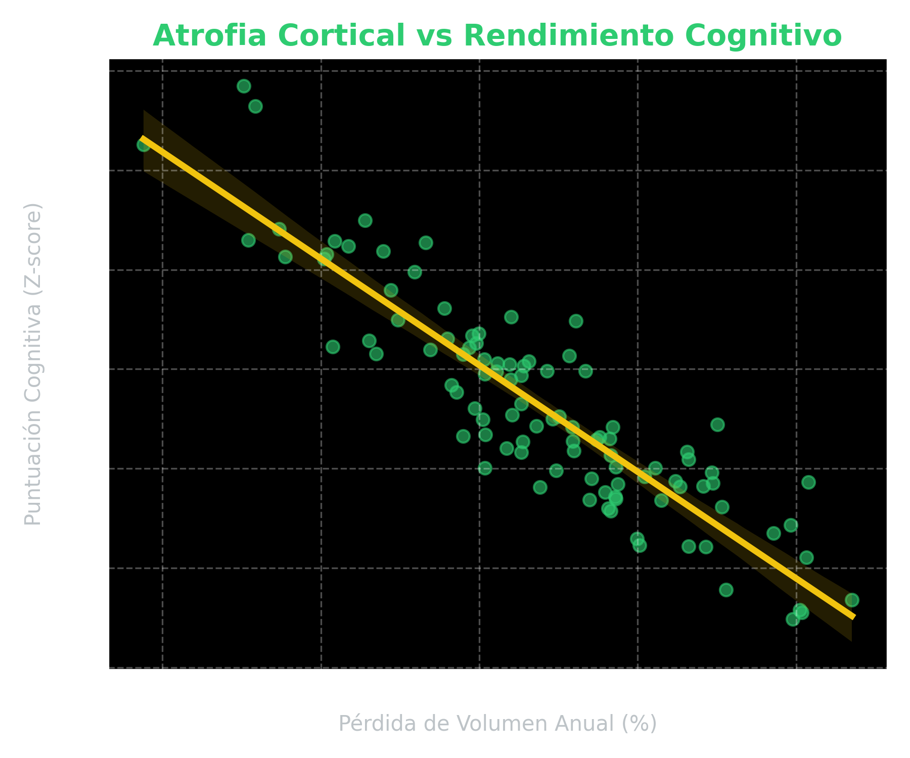

<!-- 
PREVISUALIZACIÓN:
1. Instala la extensión "Marp for VS Code".
2. Pulsa el icono de "Open Preview to the Side" (arriba a la derecha).

EXPORTACIÓN:
- Haz clic en el icono de Marp (W) en la barra de la previsualización y selecciona "Export Slide Deck".
-->

# NeurologIA: Auditoría Clínica EMRR
## Monitorización Avanzada y Progresión Estructural
### Unidad de NeuroIA · 2026

---

<!-- class: section -->

# 1. El Paisaje de la EMRR
## Datos de Cohorte y Eficacia

---

<!-- class: text-clean -->

# Dinámica de la Enfermedad

Análisis del control terapéutico en el mundo real

- **Optimización de Terapias**: Los fármacos de alta eficacia (HE) demuestran una reducción del 40% en la tasa de atrofia anual.
- **Respuesta Clínica**: El 75% de los pacientes en la cohorte EMRR-2026 mantienen un EDSS estable (< 3.0).
- **IA Predictiva**: El modelo EMRR-Forecaster identifica fallos terapéuticos con 6 meses de antelación.

"El control de los brotes es el objetivo inmediato, pero frenar la atrofia es la victoria a largo plazo."

---

# Pipeline de Decisión Clínica

Integración de Datos Multimodales

---

<!-- class: section -->

# 2. Atrofia Cortical
## El marcador invisible de la discapacidad

---

# Correlación Estructural

Cerebro vs Cognición

- La atrofia cortical es el predictor más fuerte de **deterioro cognitivo**.
- Pérdida de volumen anual > 0.4% se asocia a **progresión irreversible**.
- La detección precoz permite el cambio a **terapias de inducción**.

---

# Resumen Estratégico

Hoja de ruta para la Unidad de NeuroIA

1. **Monitorización**: Volumetría automatizada en cada RM de control.
2. **Personalización**: Ajuste de dosis basado en biomarcadores de neurofilamentos y IA.
3. **Prevención**: Intervención precoz ante el mínimo signo de "PIRA" (Progression Independent of Relapse Activity).

---

<!-- class: lead -->

# Gracias por su atención
## ¿Preguntas?
### Unidad de NeuroIA · neurologia.ai

---
